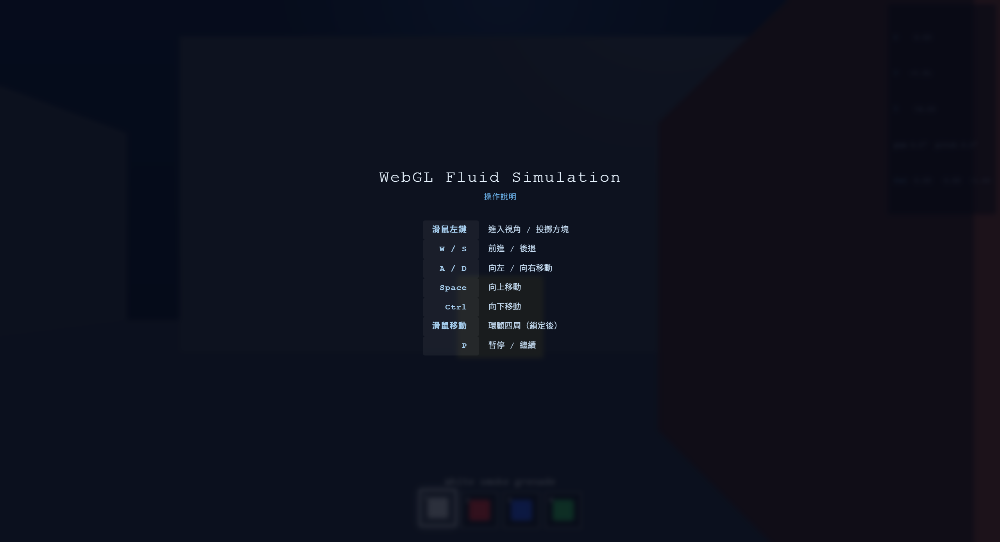

# WebGL Smoke Simulation

An interactive real-time volumetric smoke simulation built with WebGL for the NTU Computer Graphics 2025 Final Project.

[Play here](https://yaweihsu0201.github.io/ntu_computer_graphics_2025_final_project/)



## Overview

This project implements a browser-based 3D smoke simulation with real-time rendering and first-person interaction.  
The simulation is inspired by GPU fluid simulation methods and extends a 2D fluid solver into a 3D volumetric smoke system.

Users can move around the scene, throw colored smoke grenades, and observe smoke spreading, rising, swirling, and interacting visually with scene geometry.


## Features

- Real-time smoke simulation running entirely in the browser
- 3D fluid solver implemented with WebGL fragment shaders
- 3D volume stored as a 2D texture atlas
- Semi-Lagrangian advection for velocity, density, and temperature
- Buoyancy force for rising hot smoke
- Vorticity confinement for swirling smoke detail
- Pressure projection for incompressible fluid behavior
- Volumetric ray marching with soft shadow approximation
- Blinn-Phong shading for solid scene geometry
- Depth pre-pass for correct smoke occlusion with models
- First-person camera control
- Throwable smoke grenades with different smoke colors
- Hotbar UI for selecting grenade type
- GLB model loading support

## Controls

| Input | Action |
|---|---|
| Mouse click | Enter pointer lock / throw smoke grenade |
| Mouse movement | Look around |
| W / S | Move forward / backward |
| A / D | Move left / right |
| Shift | Move up |
| Ctrl | Move down |
| 1 - 4 | Select smoke grenade color |
| P | Pause / resume simulation |
| Space | Toggle depth visualization |

## Smoke Grenade Types

The project supports multiple smoke grenade types through a hotbar interface:

- White smoke grenade
- Red smoke grenade
- Blue smoke grenade
- Green smoke grenade

Each grenade has its own model tint and produces smoke with the corresponding color.

## Technical Details

### 3D Volume Representation

Because WebGL does not directly use a 3D texture in this implementation, the smoke volume is packed into a 2D texture atlas.  
A `64 x 64 x 64` volume is stored as a `512 x 512` texture by arranging the Z slices in an `8 x 8` grid.

The shader helper functions map between 3D volume coordinates and 2D atlas coordinates, allowing the simulation to sample the volume like a 3D field.

### Simulation Pipeline

Each frame performs the following simulation steps:

1. Apply buoyancy from the temperature field
2. Compute curl
3. Apply vorticity confinement
4. Compute velocity divergence
5. Solve pressure using Jacobi iterations
6. Subtract pressure gradient
7. Advect velocity, density, and temperature
8. Inject smoke from emitters or projectile impacts
9. Render the smoke volume with ray marching

### Rendering Pipeline

The final frame is rendered in three stages:

1. Render scene geometry into a depth pre-pass
2. Render solid objects using Blinn-Phong shading
3. Ray march the smoke volume and blend it over the scene

The depth pre-pass allows the smoke ray marching step to stop when it reaches solid geometry, so smoke appears correctly occluded by walls, boxes, and projectiles.

## Project Structure

```text
.
├── assets/
│   ├── images/          # Demo images and screenshots
│   └── models/          # GLB models
├── report/
│   ├── report.tex       # Project report source
│   └── report.pdf       # Project report
├── src/
│   ├── passes/          # Individual simulation and rendering passes
│   ├── config.js        # Simulation and rendering parameters
│   ├── gui.js           # UI and HUD logic
│   ├── input.js         # Keyboard and mouse controls
│   ├── model.js         # Geometry, model loading, and projectiles
│   ├── script.js        # Main initialization script
│   ├── shaders.js       # Shared shader utilities
│   ├── simulation.js    # Main simulation loop
│   ├── utils.js         # Utility functions
│   └── webgl-utils.js   # WebGL helper functions
├── index.html
├── README.md
└── LICENSE
```

## References

https://developer.nvidia.com/gpugems/gpugems/part-vi-beyond-triangles/chapter-38-fast-fluid-dynamics-simulation-gpu

https://github.com/mharrys/fluids-2d

https://github.com/haxiomic/GPU-Fluid-Experiments

## License

The code is available under the [MIT license](LICENSE)
